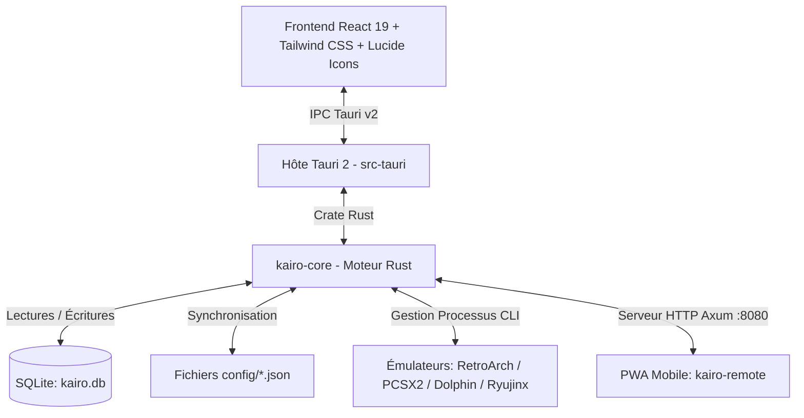

# 🕹️ KaïroOS — Architecture, État du Projet & Guide Technique (Pour Développeurs & Assistants IA)

> **Document de référence pour le développeur, Claude et les futurs contributeurs.**
> *Dernière mise à jour : Jalon 3 — Pilotage à distance & Mode Kiosk*
> *Dépôt officiel : [NayrolfRdgs/KairoOS](https://github.com/NayrolfRdgs/KairoOS)*

---

## 🧭 1. Vue d'Ensemble du Projet

**KaïroOS** est un frontend d'émulation et une station d'arcade rétro moderne pour Windows, optimisée pour le jeu au joystick arcade, à la manette, au clavier, à la souris et désormais **pilotable à distance depuis un smartphone**.

### 🌟 Points Clés & Philosophie de Design :
1. **Zéro configuration requise pour l'utilisateur final** : Les émulateurs officiels (RetroArch, PCSX2, Dolphin, Ryujinx) sont directement embarqués et pré-configurés.
2. **Double Distribution** :
   - **Mode Développement** : Démarrage ultra-rapide via Vite + Tauri (`npm run dev` ou `npm run tauri dev`).
   - **Mode Portable Autonome (`dist-portable/`)** : Déplaçable sur clé USB ou disque dur externe sans installation.
3. **Architecture Ouverte & Modifiable** : Réglages stockés à la fois dans SQLite (`kairo.db`) et dans des fichiers JSON ouverts dans `config/` (`settings.json`, `emulators.json`, `gamepads.json`, `remote.json`).
4. **Mode Borne Arcade & Kiosk Sécurisé** : Plein écran exclusif, Always-on-Top pour masquer Windows, verrouillage des réglages en mode salle, déverrouillage par PIN et combo joystick.
5. **Télécommande Mobile Intégrée (PWA)** : Serveur Axum HTTP embarqué diffusant une interface mobile tactile légère pour piloter la borne depuis un smartphone.

---

## 🏗️ 2. Architecture Technique



### 📁 Arborescence des Dossiers Principaux :
```text
Kairo/
├── crates/
│   └── kairo-core/                 # Moteur métier Rust autonome
│       └── src/
│           ├── db/                 # Gestion SQLite, tables, migrations et synchro JSON
│           ├── launcher/           # Lancement des processus émulateurs et capture PID
│           ├── models/             # Modèles Rust (Game, System, Emulator, GamepadMapping...)
│           ├── remote/             # Serveur HTTP Axum embarqué + API REST + service statique PWA
│           ├── scanner/            # Scanner de ROMs, détection franchises, métadonnées locales
│           └── lib.rs              # 6/6 tests unitaires validés
├── src-tauri/                       # Hôte d'application Tauri 2
│   ├── src/
│   │   ├── commands.rs             # Handlers IPC (get_app_mode, set_app_mode, get_remote_config...)
│   │   └── lib.rs                  # Point d'entrée, parseur CLI --mode kiosk/admin, démarrage serveur Axum
│   └── tauri.conf.json             # Configuration Tauri
├── src/                            # Frontend Borne React 19
│   ├── components/
│   │   ├── games/                  # Grille de jeux, cartes, jaquettes et overlays
│   │   ├── layout/                 # Barre latérale (Sidebar) et barre de filtre/recherche
│   │   ├── modals/                 # Modales (GameDetails, Gamepad, Settings, Scanner, Franchise, KioskUnlock)
│   │   └── overlay/                # Overlay de lancement et capture
│   ├── hooks/                      # useLibrary, useLauncher, useAppSettings, useGamepad (avec combo Kiosk)
│   ├── types/                      # Types TypeScript (AppMode, RemoteConfig, GamepadMapping...)
│   ├── api/                        # Client IPC Tauri modulaire
│   └── App.tsx                     # Composant racine
├── kairo-remote/                   # Mini PWA Mobile autonome (React + Vite + TailwindCSS)
│   ├── src/                        # Dashboard en direct, liste des jeux, ajout de ROM, déverrouillage PIN
│   └── dist/                       # Fichiers compilés servis statiquement par Axum sur http://IP:8080
├── emulators/                      # Émulateurs pré-installés (RetroArch, PCSX2, Dolphin, Ryujinx)
├── config/                         # Fichiers de configuration JSON
│   ├── settings.json               # Réglages généraux
│   ├── emulators.json              # Définition des chemins émulateurs
│   ├── gamepads.json               # Configurations des manettes J1 à J10
│   └── remote.json                 # Configuration du serveur distant (Port 8080, PIN 1234)
├── roms/                           # Dossier local de ROMs
└── scripts/                        # Scripts utilitaires
    ├── build-portable.mjs          # Packaging autonome complet
    ├── download-all-emulators.mjs  # Téléchargement de la suite d'émulation
    └── install-ryujinx.mjs         # Installateur Ryujinx
```

---

## ⚙️ 3. Fonctionnalités Implémentées (Jalons 1, 2 et 3)

### A. Serveur HTTP Embarqué & API REST (`kairo-core/src/remote/`)
- Démarrage automatique en tâche de fond Tokio sur le port configuré dans `config/remote.json` (défaut : `8080`).
- **Routes REST** :
  - `GET /api/status` : État de la borne (jeu en cours, mode kiosk, port, version).
  - `GET /api/games` & `GET /api/games/:id` : Consultation de la bibliothèque de jeux.
  - `POST /api/games/launch` : Lancement d'un jeu à distance (`X-Kairo-Pin` requis).
  - `POST /api/games/stop` : Arrêt d'urgence du jeu en cours (`X-Kairo-Pin` requis).
  - `POST /api/games/add` : Ajout d'une ROM à distance (`X-Kairo-Pin` requis).
  - `GET /api/systems` : Liste des consoles supportées.
  - `GET /api/settings` & `POST /api/settings` : Consultation / modification des paramètres.
  - `POST /api/kiosk/lock` : Activation du mode Kiosk (`X-Kairo-Pin` requis).
  - `POST /api/kiosk/unlock` : Déverrouillage vers mode Admin avec `{ "pin": "..." }`.

### B. Mode Kiosk (Mode Salle d'Arcade)
- **Déclenchement au lancement** : Flag CLI `--mode kiosk` ou `--mode admin` (ou valeur dans `config/settings.json`).
- **En mode Kiosk** :
  - Zéro accès aux réglages et configuration.
  - Zéro accès au scanner de ROMs.
  - Zéro modification possible des métadonnées.
  - Affichage d'un badge Kiosk 🔒 dans la barre latérale.
- **Déverrouillage sur la borne** :
  - **Combo Joystick** : `LB + RB + Start` maintenu pendant **3 secondes**.
  - **Raccourci Clavier** : `Ctrl + Shift + K` ou clic sur le cadenas Kiosk.
  - Ouvre la modale arcade `KioskUnlockModal` demandant le code PIN (défaut : `1234`).

### C. PWA Mobile `kairo-remote/`
- Servie directement par Axum à l'adresse `http://<IP_BORNE>:8080/`.
- Accessible depuis n'importe quel smartphone ou tablette sur le même réseau Wi-Fi sans installation.
- Design dark arcade rétro avec touches néon et boutons tactiles larges.
- PIN stocké en mémoire pour la session.
- 5 écrans : **Dashboard**, **Jeux**, **Ajouter**, **Réglages**, **Déverrouillage Kiosk**.

### D. Contrôleurs & Suite d'Émulation Complète
- **4 Émulateurs configurés** : RetroArch x64 (+ 9 cœurs), PCSX2 Qt x64, Dolphin 2407 x64, Ryujinx 1.3.3 x64.
- **Gestionnaire Multi-Manettes (1 à 10 Joueurs)** : Assignation physique par joueur, priorité J1, interface adaptative et verrouillage de fond.

---

## 🛠️ 4. Commandes Utiles de Développement

```powershell
# 1. Lancer l'application KaïroOS (avec serveur distant axum sur :8080)
npm run tauri dev

# 2. Lancer KaïroOS en forçant le mode Kiosk
cargo run --manifest-path src-tauri/Cargo.toml -- --mode kiosk

# 3. Compiler la PWA mobile kairo-remote
npm run build:remote

# 4. Valider tous les tests unitaires Rust
cargo test --package kairo-core

# 5. Vérifier les types TypeScript du frontend
npx tsc --noEmit
```
