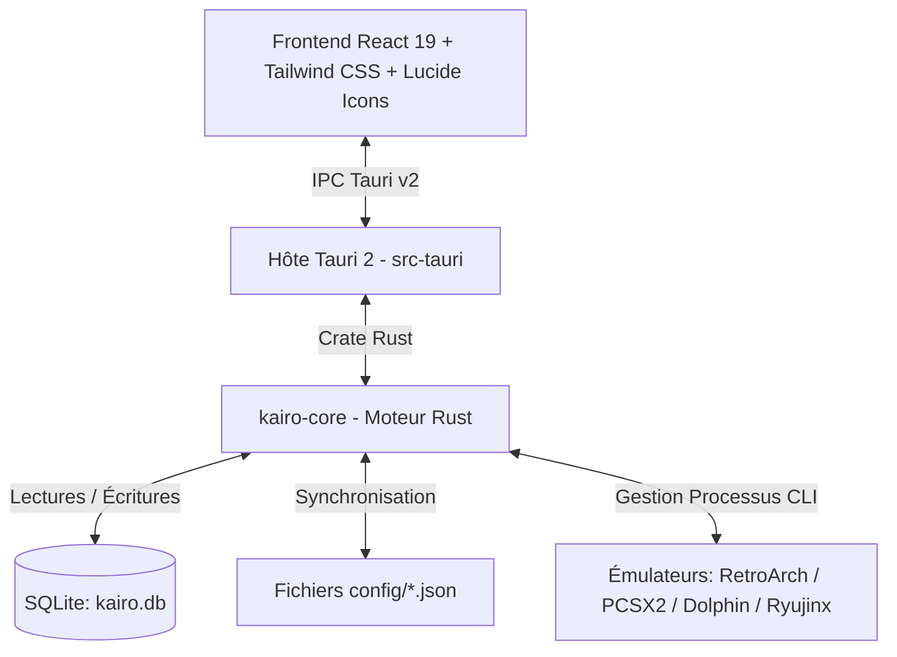

# 🕹️ KaïroOS — Architecture, État du Projet & Guide Technique (Pour Développeurs & Assistants IA)

> **Document de référence pour le développeur, Claude et les futurs contributeurs.**
> *Dernière mise à jour : 2 Septembre 2026*
> *Dépôt officiel : [NayrolfRdgs/KairoOS](https://github.com/NayrolfRdgs/KairoOS)*

---

## 🧭 1. Vue d'Ensemble du Projet

**KaïroOS** est un frontend d'émulation et une station d'arcade rétro conçue pour Windows, optimisée pour le jeu au joystick arcade, à la manette, au clavier et à la souris.

### 🌟 Points Clés & Philosophie de Design :
1. **Zéro configuration requise pour l'utilisateur final** : Les émulateurs officiels (RetroArch, PCSX2, Dolphin, Ryujinx) sont directement embarqués et pré-configurés.
2. **Double Distribution** :
   - **Mode Développement** : Démarrage ultra-rapide via Vite + Tauri (`npm run dev` ou `npm run tauri dev`).
   - **Mode Portable Autonome (`dist-portable/`)** : Déplaçable sur clé USB ou disque dur externe sans installation.
3. **Architecture Ouverte & Modifiable** : Tous les réglages sont stockés à la fois dans SQLite (`kairo.db`) et dans des fichiers JSON lisibles et modifiables à la main dans le dossier `config/` (`settings.json`, `emulators.json`, `gamepads.json`, `remote.json`).
4. **Mode Borne Arcade & Kiosk** : Plein écran exclusif, Always-on-Top pour masquer Windows, raccourci global `F11`.
5. **Thème Clair Arcade Années 80** : Palette rétro soignée aux tons crèmes, panneaux chaleureux et néons rétro (Jaune arcade, Rouge, Bleu, Vert, Orange).

---

## 🏗️ 2. Architecture Technique

Le projet repose sur une architecture moderne en 3 couches :



### 📁 Arborescence des Dossiers Principaux :
```text
Kairo/
├── crates/
│   └── kairo-core/                 # Moteur métier Rust autonome
│       └── src/
│           ├── db/                 # Gestion SQLite, tables, migrations et synchro JSON
│           ├── launcher/           # Lancement des processus émulateurs et capture PID
│           ├── models/             # Modèles Rust (Game, System, Emulator, GamepadMapping...)
│           ├── scanner/            # Scanner de ROMs, détection franchises, métadonnées locales
│           └── lib.rs              # 6/6 tests unitaires validés
├── src-tauri/                       # Hôte d'application Tauri 2
│   ├── src/
│   │   ├── commands.rs             # Handlers IPC (invoke)
│   │   └── lib.rs                  # Point d'entrée, initialisation DB et fenêtrage
│   └── tauri.conf.json             # Configuration du bundle Windows & NSIS
├── src/                            # Frontend React 19
│   ├── components/
│   │   ├── Sidebar.tsx             # Barre latérale gauche (consoles, franchises, raccourci ⚙️ et 🎮)
│   │   ├── FilterBar.tsx           # Recherche temps réel, filtres de genre et tri multi-critères
│   │   ├── GameGrid.tsx            # Grille de cartes de jeux responsive
│   │   ├── GameCard.tsx            # Carte de jeu rétro avec jaquette, badges et favoris
│   │   ├── GameDetailsModal.tsx    # Fiche complète du jeu + éditeur de métadonnées JSON
│   │   ├── GamepadSettingsModal.tsx# Gestionnaire multi-manettes 1-10 joueurs avec remapping et testeur live
│   │   ├── SettingsModal.tsx       # Paramètres du mode borne, franchises visibles, chemins
│   │   ├── ScannerModal.tsx        # Assistant de scan de ROMs (par défaut ./roms)
│   │   ├── FranchiseOrganizerModal.tsx # Outil de déplacement dans dossier de saga
│   │   └── LaunchOverlay.tsx       # Overlay d'attente pendant qu'un jeu tourne
│   ├── hooks/
│   │   └── useGamepad.ts           # Hook de navigation manette/clavier avec verrouillage de fond
│   ├── types/                      # Définitions TypeScript
│   ├── App.tsx                     # Composant racine et gestion d'état centralisée
│   └── index.css                   # Variables CSS du thème clair 80s
├── emulators/                      # Émulateurs pré-installés pour le mode DEV
│   ├── RetroArch/                  # RetroArch x64 + 9 cœurs Libretro DLLs
│   ├── PCSX2/                      # PCSX2 Qt x64 (PlayStation 2)
│   ├── Dolphin/                    # Dolphin 2407 x64 (GameCube & Wii)
│   └── Ryujinx/                    # Ryujinx 1.3.3 x64 (Nintendo Switch)
├── config/                         # Fichiers de configuration ouverts (JSON)
│   ├── settings.json               # Réglages généraux de l'application
│   ├── emulators.json              # Chemins et templates CLI des émulateurs
│   ├── gamepads.json               # Configurations des manettes J1 à J10
│   └── remote.json                 # Réglages serveur distant / PWA
├── roms/                           # Dossier local de jeux par défaut
├── dist-portable/                  # Package autonome clé USB (généré à la demande)
└── scripts/                        # Scripts Node.js utilitaires
    ├── build-portable.mjs          # Packaging standalone sans verrouillage
    ├── download-all-emulators.mjs  # Téléchargement automatique de la suite d'émulation
    ├── install-ryujinx.mjs         # Installateur dédié Ryujinx 1.3.3
    └── setup-emulators.mjs         # Téléchargement RetroArch + cœurs
```

---

## ⚙️ 3. Ce qui a été Implémenté & Fonctionne Actuellement

### A. Suite d'Émulation Complète Embarquée
- **RetroArch x64** avec 9 cœurs Libretro officiels :
  - SNES (`snes9x`), PS1 (`swanstation`), N64 (`mupen64plus`), GBA (`mgba`), Game Boy (`gambatte`), Mega Drive (`genesis_plus_gx`), Arcade FBNeo (`fbneo`), NES (`fceumm`), Dreamcast (`flycast`).
- **PCSX2 Qt x64** (PS2) : Pré-configuré avec l'interface Qt moderne.
- **Dolphin 2407 x64** (GameCube & Wii).
- **Ryujinx 1.3.3 x64** (Nintendo Switch).
- Tous les émulateurs sont synchronisés automatiquement dans le dossier de développement et le dossier portable.

### B. Gestionnaire Multi-Contrôleurs (1 à 10 Joueurs)
- **Assignation Physique des Périphériques** : Choix de la manette branchée (ex: Manette #0, Manette #1) pour chaque Joueur J1 à J10.
- **Priorité J1** : Le Joueur 1 (⭐) possède la priorité exclusive sur la navigation dans l'interface de KaïroOS pour éviter les conflits d'entrée.
- **Interface Visuelle Dynamique** : L'affichage s'adapte en temps réel au type de matériel sélectionné :
  - *Borne / Arcade Stick* : Joystick rouge + 6/8 boutons arcade + boutons Coin 🪙 et Start 🕹️.
  - *Manette Moderne (Xbox/PS)* : Disposition ABXY, sticks analogiques L3/R3, gâchettes LB/RB/LT/RT.
  - *Rétro SNES / Mega Drive* : Disposition rétro fidèle.
- **Testeur en Temps Réel** : Les boutons s'illuminent au néon quand on appuie dessus.
- **Assistant de Remapping (Wizard)** : Configuration touche par touche guidée.
- **Injection Automatique** : Sauvegarde dans `config/gamepads.json` et écriture directe dans `retroarch.cfg` (`input_player1_btn`, etc.).
- **Verrouillage d'Arrière-Plan** : Dès qu'une fenêtre ou la modale des manettes est ouverte, toutes les entrées de l'interface en arrière-plan sont coupées pour empêcher tout lancement accidentel.

### C. Organisation des ROMs & Fichiers Locaux
- **Chemin Relatif `./roms` par Défaut** : Détection immédiate du dossier de jeux adjacent sans obliger à saisir un chemin.
- **Dossiers de Sagas Multi-Consoles** : Possibilité de regrouper des ROMs de plusieurs consoles dans un même sous-dossier (ex: `roms/Super Mario/` contenant un jeu SNES `.sfc`, N64 `.z64` et Switch `.nsp`). Le scanner détecte la console par l'extension du fichier.
- **Sous-Dossiers Dédiés par Jeu** :
  ```text
  roms/snes/Super Mario World/
  ├── Super Mario World.sfc    (Fichier de jeu)
  ├── metadata.json            (Titre, date, éditeur, note, synopsis)
  ├── config.json              (Émulateur spécifique, shader, ratio)
  └── cover.png                (Jaquette frontale)
  ```

### D. Navigation & Filtrage
- Tri instantané : *Nom (A-Z / Z-A)*, *Date de sortie (Récents / Anciens)*, *Note (⭐)*, *Temps de jeu*, *Plus fréquents*.
- Filtre par Genre (*Plateforme, Combat, Course, RPG, Aventure...*).
- Barre latérale dynamique avec décompte par console et par saga.
- Gestion des Favoris (⭐) et historique de parties avec temps de jeu cumulé.

---

## 💡 4. Propositions d'Améliorations & Roadmap Future

Voici les fonctionnalités majeures recommandées pour continuer à enrichir KaïroOS :

### 1. 🌐 Scraper Automatique ScreenScraper API
- **Objectif** : Télécharger automatiquement en un clic toutes les jaquettes 3D, captures d'écran, logos transparents (Wheels) et résumés en français depuis l'API ScreenScraper.fr.
- **Fonctionnement prévu** :
  - L'utilisateur entre ses identifiants ScreenScraper dans `config/settings.json`.
  - Le scanner calcule le hash SHA1 de chaque ROM et interroge l'API pour récupérer les médias et les enregistrer directement en `cover.png` et `metadata.json`.

### 2. 📱 Télécommande Mobile & Accès Distant (Module `kairo-remote` / PWA)
- **Objectif** : Piloter la borne d'arcade depuis un smartphone ou une tablette connectée au même réseau Wi-Fi.
- **Fonctionnement prévu** :
  - Serveur WebSocket léger intégré dans KaïroOS (port 8080 configuré dans `config/remote.json`).
  - Interface web mobile affichant une manette virtuelle tactile, la liste des jeux et un bouton "Lancer sur la borne".
  - Possibilité d'envoyer des ROMs directement depuis son téléphone vers la borne.

### 3. 📺 Système de Shaders CRT Rétro & Filtres Visuels
- **Objectif** : Recréer l'aspect authentique des téléviseurs cathodiques (lignes de scanlines, courbure d'écran, lueur phosphore).
- **Fonctionnement prévu** :
  - Menu déroulant dans la fiche de chaque jeu : *CRT Facile*, *Scanlines 80s*, *Pixels Nets*, *Lissage Bilinéaire*.
  - Injection automatique du shader choisi dans les paramètres de lancement de RetroArch / PCSX2 / Dolphin.

### 4. 🏆 Système de Succès Rétro (RetroAchievements API)
- **Objectif** : Afficher les trophées et succès débloqués en jeu directement sur les fiches des jeux dans l'interface de KaïroOS.

---

## 🛠️ 5. Commandes Essentielles pour le Développement

```powershell
# Se positionner dans le dossier du projet
cd C:\Users\propo\Music\Kairo

# 1. Lancer le frontend dans le navigateur (développement rapide)
npm run dev

# 2. Lancer l'application complète Tauri 2 (fenêtre native Windows + manettes)
npm run tauri dev

# 3. Vérifier les types TypeScript sans compiler
npx tsc --noEmit

# 4. Exécuter les tests unitaires du backend Rust
cargo test --package kairo-core

# 5. Télécharger ou mettre à jour tous les émulateurs (RetroArch, PCSX2, Dolphin, Ryujinx)
node scripts/download-all-emulators.mjs

# 6. Générer le package portable autonome uniquement quand nécessaire
npm run build:portable
```
