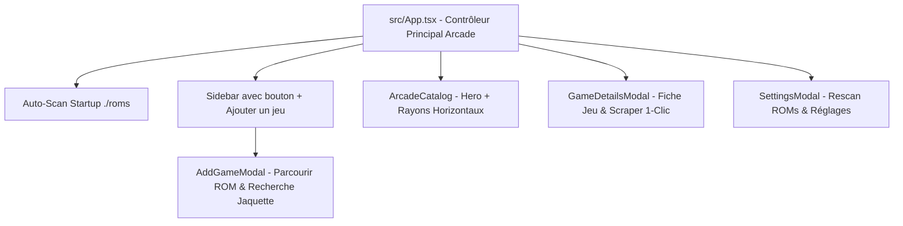

# 🕹️ KaïroOS — Architecture, État du Projet & Guide Technique (Pour Développeurs & Assistants IA)

> **Document de référence pour le développeur, Claude et les futurs contributeurs.**
> *Dernière mise à jour : Mode Portable Auto-Scan, Ajout Manuel de ROMs, Scraper 1-Clic Jaquettes & Rescan Paramètres*
> *Dépôt officiel : [NayrolfRdgs/KairoOS](https://github.com/NayrolfRdgs/KairoOS)*

---

## 🧭 1. Gestion des ROMs & Mode Portable Autonome

### A. Emplacement Racine des ROMs & Scan Automatique au Démarrage
- **En mode portable** : Les jeux sont placés directement à la racine de l'application dans le dossier `./roms` (ou le dossier `roms` adjacent à l'exécutable).
- **Scan automatique au lancement** : Dès le démarrage de **KaïroOS**, l'application déclenche automatiquement un scan en arrière-plan du dossier `./roms`. Tout jeu nouvellement copié est instantanément indexé et affiché dans le catalogue !

### B. Ajout Manuel de Jeu & Parcourir (`AddGameModal`)
- Bouton **`+` (Ajouter un jeu)** accessible directement en haut de la Sidebar.
- Permet de parcourir son disque dur / clé USB pour sélectionner une ROM ou un exécutable PC.
- Choix de la console / système et auto-détection du titre.
- Bouton **`🔍 Rechercher Jaquette`** intégré pour trouver la jaquette en 1 clic avant l'ajout !

### C. Récupération Automatique de Jaquettes & Métadonnées (Scraping 1-Clic)
- Dans la fiche d'un jeu (`GameDetailsModal` ➔ `Éditer Métadonnées`) :
  - Bouton **`🔍 Actualiser automatiquement les informations`** pour récupérer le titre officiel, l'année, le développeur, le genre, la note et la jaquette.
  - Enregistrement immédiat dans le fichier `.json` adjacent à la ROM pour une portabilité 100% autonome.

### D. Actualisation / Rescan depuis les Paramètres (`SettingsModal`)
- Dans **Paramètres** ➔ **Dossiers & Réseau** :
  - Bouton **`🔄 Actualiser les Jeux (Rescan des ROMs)`** avec affichage des statistiques (nombre de fichiers scannés, jeux ajoutés, jeux mis à jour).
  - Sélecteur de dossier ROMs avec bouton **Parcourir** 📂.

---

## 🏗️ 2. Architecture des Composants Frontend (`src/`)



---

## 🛠️ 3. Commandes de Démarrage

```powershell
# Démarrer KaïroOS en mode Dev
npm run tauri dev

# Lancer la PWA distante
npm --prefix kairo-remote run dev
```
