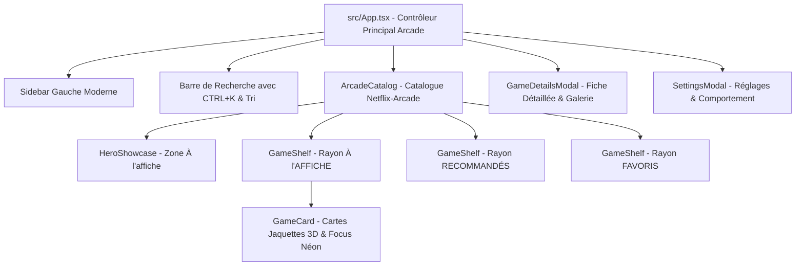

# 🕹️ KaïroOS — Architecture, État du Projet & Guide Technique (Pour Développeurs & Assistants IA)

> **Document de référence pour le développeur, Claude et les futurs contributeurs.**
> *Dernière mise à jour : Refonte Graphique Complète — Interface Borne Arcade Premium (Blanc / Lilas / Magenta / Violet)*
> *Dépôt officiel : [NayrolfRdgs/KairoOS](https://github.com/NayrolfRdgs/KairoOS)*

---

## 🧭 1. Vue d'Ensemble & Nouvelle Direction Visuelle

**KaïroOS** arbore désormais une **interface de borne d'arcade haut de gamme futuriste et lumineuse** :
- **Palette Principale** : Fond blanc / blanc bleuté et lavande douce (`#f8f7ff`), accents vibrants **Magenta / Rose néon** (`#e11d48`, `#f43f5e`, `#ec4899`), touches de **Violet** (`#7c3aed`, `#6366f1`), typographie foncée ardoise pour un contraste idéal à distance.
- **Cartes & Verre Translucide** : Effet glassmorphism léger avec ombres douces et halos néon magenta.
- **Expérience Catalogue façon Netflix + Arcade** :
  - **Zone Héro "À L'AFFICHE"** : Immense vitrine interactive (Street Fighter II, Metal Slug 3, Sonic 2, Zelda...) avec grand artwork, note en étoiles, tags de genres, synopsis et carrousel vertical de screenshots.
  - **Rayons Horizontaux Déroulants** : `| À L'AFFICHE`, `| RECOMMANDÉ POUR VOUS`, `| FAVORIS`, `| RÉCEMMENT JOUÉS` avec jaquettes 3D, badges Année et Note.
- **Focus Manette / Joystick Arcade Ultra-Visible** : Halo lumineux magenta + agrandissement fluide (`scale-105`) pour repérer instantanément la sélection sur un écran de borne à plusieurs mètres.
- **Comportement Configurable au Clic / Touche A** :
  - `Option 1 : Lancer directement` (Instant Launch)
  - `Option 2 : Afficher la fiche du jeu` (Rich Game Details Page)

---

## 🏗️ 2. Architecture des Composants Frontend (`src/`)



---

## 📱 3. PWA de Pilotage Distant (`kairo-remote/`)

- Écran de connexion avec vérification de PIN obligatoire (`POST /api/auth/login`).
- Hub de choix : **Panneau d'Administration** 🖥️ ou **Manette Virtuelle Sans-Fil (J1-J4)** 🎮.
- Contrôle en temps réel avec simulation d'entrées clavier sous Windows.

---

## 🛠️ 4. Commandes de Démarrage

```powershell
# Lancer l'application borne en développement
npm run tauri dev

# Lancer la PWA distante
npm --prefix kairo-remote run dev
```
