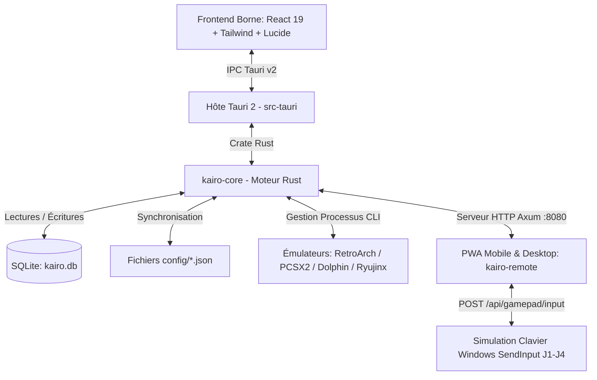

# 🕹️ KaïroOS — Architecture, État du Projet & Guide Technique (Pour Développeurs & Assistants IA)

> **Document de référence pour le développeur, Claude et les futurs contributeurs.**
> *Dernière mise à jour : Thème Clair Sobre Admin, Écran Login PIN, Hub de Sélection & Manette Virtuelle Multi-Téléphones*
> *Dépôt officiel : [NayrolfRdgs/KairoOS](https://github.com/NayrolfRdgs/KairoOS)*

---

## 🧭 1. Vue d'Ensemble du Projet

**KaïroOS** est un frontend d'émulation et une station d'arcade rétro moderne pour Windows, optimisée pour le jeu au joystick arcade, à la manette physique, au clavier, et désormais **pilotable à distance depuis un smartphone ou un PC via sa PWA épurée et sa Manette Virtuelle Multi-Joueurs**.

### 🌟 Points Clés & Philosophie de Design :
1. **Zéro configuration requise pour l'utilisateur final** : Les émulateurs officiels (RetroArch, PCSX2, Dolphin, Ryujinx) sont directement embarqués et pré-configurés.
2. **Double Distribution** :
   - **Mode Développement** : Démarrage ultra-rapide via Vite + Tauri (`npm run dev` ou `npm run tauri dev`).
   - **Mode Portable Autonome (`dist-portable/`)** : Déplaçable sur clé USB ou disque dur externe sans installation.
3. **Sécurité & Authentification Obligatoire** : Connexion par code PIN sécurisé (défaut : `1234`) avant tout accès aux commandes ou aux réglages.
4. **Hub de Choix à la Connexion** :
   - 🖥️ **Panneau d'Administration Sobre & Clair** : Gestion du catalogue, lancement de jeux, configuration réseau/émulateurs, mode kiosk.
   - 🎮 **Manette Virtuelle Sans-Fil (Virtual Gamepad)** : Transforme n'importe quel smartphone en manette tactile de jeu.
5. **Support Multi-Téléphones (J1 à J4)** : Plusieurs smartphones peuvent se connecter simultanément à la même borne en choisissant leur slot de joueur respectif.

---

## 🏗️ 2. Architecture Technique



---

## 📱 3. PWA KaïroOS Remote (`kairo-remote/`)

### A. Thème Clair Sobre & Propre (Style Admin Panel)
- **Thème Clair par défaut** : Fond gris clair sobre (`#f8fafc`), cartes blanches nettes (`#ffffff`), bordures subtiles (`#e2e8f0`), typographie soignée et touches d'accent indigo professionnelles (`#4f46e5`).
- **Thème Sombre disponible** en option via le bouton ☀️/🌙 dans l'en-tête.

### B. Écran de Connexion Obligatoire (`LoginScreen`)
- Dès l'ouverture de `http://<IP_BORNE>:8080`, un écran de connexion sobre demande obligatoirement le code PIN.
- Vérification instantanée via `POST /api/auth/login`.
- Empêche tout accès non autorisé à la borne ou aux commandes.

### C. Hub de Sélection de Mode (`ModeSelector`)
- Une fois authentifié, l'utilisateur choisit :
  - **🖥️ Panneau d'Administration** : Vue d'ensemble de la borne, catalogue des jeux, arrêt d'urgence, réglages réseau, émulateurs, mode salle.
  - **🎮 Manette Virtuelle** : Manette tactile plein écran multi-joueurs.

### D. Manette Virtuelle Multi-Téléphones (`VirtualGamepad`)
- **Sélecteur de Joueur** : Choix instantané du slot **J1**, **J2**, **J3** ou **J4**.
- **Plusieurs téléphones simultanés** : Chaque ami/joueur ouvre l'adresse sur son téléphone, choisit son joueur (ex: Téléphone 1 sur J1, Téléphone 2 sur J2) et joue ensemble sur la borne.
- **Contrôles Tactiles à Faible Latence** :
  - **Croix directionnelle (D-Pad)** : Haut, Bas, Gauche, Droite.
  - **Boutons Arcade** : A, B, X, Y (disposition standard).
  - **Gâchettes** : L1, L2, R1, R2.
  - **Boutons Centraux** : Select / Coin, Start.
  - **Retour Haptique** : Vibrations légères sur smartphones compatibles (`navigator.vibrate`).
- **Simulation Système sous Windows** : Envoi des inputs via `POST /api/gamepad/input` mappé sur `SendInput` Windows pour contrôler directement les jeux dans les émulateurs !

---

## 🌐 4. API Distante Axum (`kairo-core/src/remote/`)

| Méthode | Route | Description | Authentification |
| :--- | :--- | :--- | :--- |
| `POST` | `/api/auth/login` | Vérification du mot de passe PIN | 🔑 Body `{ "pin": "..." }` |
| `POST` | `/api/gamepad/input` | Envoi d'un événement touche manette (J1-J4) | 🔑 `X-Kairo-Pin` |
| `GET` | `/api/status` | État de la borne (jeu en cours, jaquette, durée, IP) | ❌ Libre |
| `GET` | `/api/system/info` | Infos système (IP, port, version, dossier install, total jeux) | ❌ Libre |
| `GET` | `/api/games` | Liste des jeux | ❌ Libre |
| `GET` | `/api/games/recent` | Top 5 des jeux récents | ❌ Libre |
| `POST` | `/api/games/launch` | Lancer un jeu sur la borne | 🔑 `X-Kairo-Pin` |
| `POST` | `/api/games/stop` | Arrêter d'urgence le jeu en cours | 🔑 `X-Kairo-Pin` |
| `POST` | `/api/games/:id/favorite` | Basculer favori d'un jeu | 🔑 `X-Kairo-Pin` |
| `POST` | `/api/kiosk/lock` | Activer le mode Kiosk | 🔑 `X-Kairo-Pin` |
| `POST` | `/api/kiosk/unlock` | Déverrouiller le mode Admin | 🔑 Validation PIN |

---

## 🛠️ 5. Commandes Utiles

```powershell
# 1. Démarrer KaïroOS en mode Dev
npm run tauri dev

# 2. Rebuilder la PWA kairo-remote
npm run build:remote

# 3. Exécuter les tests unitaires Rust
cargo test --package kairo-core
```
