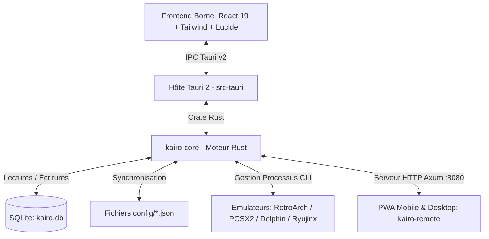

# 🕹️ KaïroOS — Architecture, État du Projet & Guide Technique (Pour Développeurs & Assistants IA)

> **Document de référence pour le développeur, Claude et les futurs contributeurs.**
> *Dernière mise à jour : Refonte PWA Mobile/Desktop & API Distante Avancée*
> *Dépôt officiel : [NayrolfRdgs/KairoOS](https://github.com/NayrolfRdgs/KairoOS)*

---

## 🧭 1. Vue d'Ensemble du Projet

**KaïroOS** est un frontend d'émulation et une station d'arcade rétro moderne pour Windows, optimisée pour le jeu au joystick arcade, à la manette, au clavier, à la souris et désormais **pilotable à distance depuis un smartphone ou un PC via sa PWA enrichie**.

### 🌟 Points Clés & Philosophie de Design :
1. **Zéro configuration requise pour l'utilisateur final** : Les émulateurs officiels (RetroArch, PCSX2, Dolphin, Ryujinx) sont directement embarqués et pré-configurés.
2. **Double Distribution** :
   - **Mode Développement** : Démarrage ultra-rapide via Vite + Tauri (`npm run dev` ou `npm run tauri dev`).
   - **Mode Portable Autonome (`dist-portable/`)** : Déplaçable sur clé USB ou disque dur externe sans installation.
3. **Architecture Ouverte & Modifiable** : Réglages stockés à la fois dans SQLite (`kairo.db`) et dans des fichiers JSON ouverts dans `config/` (`settings.json`, `emulators.json`, `gamepads.json`, `remote.json`).
4. **Mode Borne Arcade & Kiosk Sécurisé** : Plein écran exclusif, Always-on-Top pour masquer Windows, verrouillage des réglages en mode salle, déverrouillage par PIN et combo joystick.
5. **Télécommande Mobile & Desktop Tactile (PWA)** : Serveur Axum HTTP embarqué diffusant une interface PWA réactive (Dark / Light 80s Arcade, multi-colonnes desktop, jaquettes de jeux, chronomètre de session, pavé numérique arcade).

---

## 🏗️ 2. Architecture Technique



---

## 📱 3. PWA KaïroOS Remote (`kairo-remote/`)

### A. Thèmes Clair & Sombre
- **Thème Sombre** : Palette arcade moderne (`#121019`, `#1e1a29`, bordures `#3c3452`, accents néon cyan, cherry, violet).
- **Thème Clair (80s Arcade Light)** : Teintes crèmes douces (`#fbf8f2`, `#f4efe6`), cartes blanches et accents néon vifs (cherry `#ff3366`, orange arcade `#ff5500`, vert émeraude `#10b981`).
- **Persistance en mémoire** : Bascule instantanée via le bouton ☀️/🌙 dans le header sans rechargement.

### B. Layout Responsive (Desktop & Mobile)
- **Sur Mobile (< 768px)** : En-tête compact, navigation par barre inférieure fixe avec pastilles d'activité (Borne, Jeux, Ajouter, Réglages, Kiosk).
- **Sur PC / Tablette (>= 768px)** : Barre latérale gauche dédiée (260px) avec compteurs de jeux en temps réel, adresse IP locale, et vue en grille multi-colonnes.

### C. Tableau de Bord (Dashboard)
- **Session en Direct** :
  - Nom du jeu en cours et console associée.
  - **Jaquette grand format**.
  - **Chronomètre de session en temps réel** (décompte dynamique heure/minute/seconde).
  - **Bouton STOP D'URGENCE** rouge néon pour quitter l'émulateur immédiatement.
- **Historique des 5 derniers jeux lancés** : Liste des dernières parties jouées avec bouton "Relancer 🚀".
- **Contrôle Kiosk Immédiat** : Statut de verrouillage et bouton de déverrouillage PIN direct.
- **Accès Réseau** : Affichage de l'URL directe (ex: `http://192.168.1.30:8080`) avec bouton de copie rapide.

### D. Bibliothèque de Jeux Enrichie
- Affichage des jaquettes de jeux (`cover_url`).
- Badges console colorés distincts (SNES, PS1, PS2, N64, GameCube, Switch, Arcade, Mega Drive).
- **Indicateur visuel dynamique** sur le jeu actuellement en cours (halo vert animé + badge "🎮 EN JEU").
- **Bouton Favoris (⭐)** interactif directement synchronisé avec SQLite.
- Filtre par console et barre de recherche instantanée.

### E. Pavé Numérique Arcade (`ArcadeKeypad`)
- Pavé 3x4 ergonomique avec touches 0-9, touche Effacer ⌫, touche Clear C et validation.
- Support du tactile, de la souris et du clavier physique.
- Utilisé pour la saisie du PIN de session et le déverrouillage Kiosk à distance.

### F. Page Réglages Enrichie (4 Sous-sections)
1. **Serveur Remote (`config/remote.json`)** : Port, PIN de sécurité (avec confirmation), Allowed Origins CORS.
2. **Émulateurs (`config/emulators.json`)** : Visualisation et édition des chemins d'exécutables (`exe_path`) et arguments CLI (`default_args`).
3. **Paramètres Borne (`config/settings.json`)** : Dossier ROMs par défaut, mode Kiosk au démarrage, Always-on-top.
4. **Infos Système** : Version logicielle (`v0.1.0`), chemin d'installation, IP Locale de la machine.

---

## 🌐 4. Routes REST de l'API Axum (`kairo-core/src/remote/`)

| Méthode | Route | Description | Authentification |
| :--- | :--- | :--- | :--- |
| `GET` | `/api/status` | État complet (jeu en cours, jaquette, chronomètre, kiosk, IP locale) | ❌ Libre |
| `GET` | `/api/system/info` | Infos système (IP, port, version, dossier install, total jeux) | ❌ Libre |
| `GET` | `/api/games` | Liste complète des jeux | ❌ Libre |
| `GET` | `/api/games/recent` | Top 5 des jeux récemment joués | ❌ Libre |
| `GET` | `/api/games/:id` | Détail d'un jeu | ❌ Libre |
| `POST` | `/api/games/:id/favorite` | Basculer le statut favori d'un jeu | 🔑 `X-Kairo-Pin` |
| `POST` | `/api/games/launch` | Lancer un jeu sur la borne | 🔑 `X-Kairo-Pin` |
| `POST` | `/api/games/stop` | Arrêter d'urgence le jeu en cours | 🔑 `X-Kairo-Pin` |
| `POST` | `/api/games/add` | Ajouter une ROM à la bibliothèque | 🔑 `X-Kairo-Pin` |
| `GET` | `/api/systems` | Liste des consoles | ❌ Libre |
| `GET` | `/api/emulators` | Liste des émulateurs et configurations CLI | ❌ Libre |
| `POST` | `/api/emulators` | Sauvegarder `config/emulators.json` | 🔑 `X-Kairo-Pin` |
| `GET` | `/api/settings` | Lire `config/settings.json` | ❌ Libre |
| `POST` | `/api/settings` | Sauvegarder `config/settings.json` | 🔑 `X-Kairo-Pin` |
| `GET` | `/api/remote/config` | Lire `config/remote.json` | ❌ Libre |
| `POST` | `/api/remote/config` | Sauvegarder `config/remote.json` | 🔑 `X-Kairo-Pin` |
| `POST` | `/api/kiosk/lock` | Activer le mode Kiosk | 🔑 `X-Kairo-Pin` |
| `POST` | `/api/kiosk/unlock` | Déverrouiller le mode Admin avec `{ "pin": "..." }` | 🔑 Validation PIN |
| `GET` | `/*` | Service statique de la PWA `kairo-remote/dist` | ❌ Libre |

---

## 🛠️ 5. Commandes de Développement & Build

```powershell
# 1. Démarrer KaïroOS en mode Dev (Borne + Serveur Remote sur :8080)
npm run tauri dev

# 2. Rebuilder uniquement la PWA kairo-remote
npm run build:remote

# 3. Lancer les tests unitaires du moteur Rust
cargo test --package kairo-core

# 4. Vérifier les types TypeScript du frontend principal
npx tsc --noEmit
```
