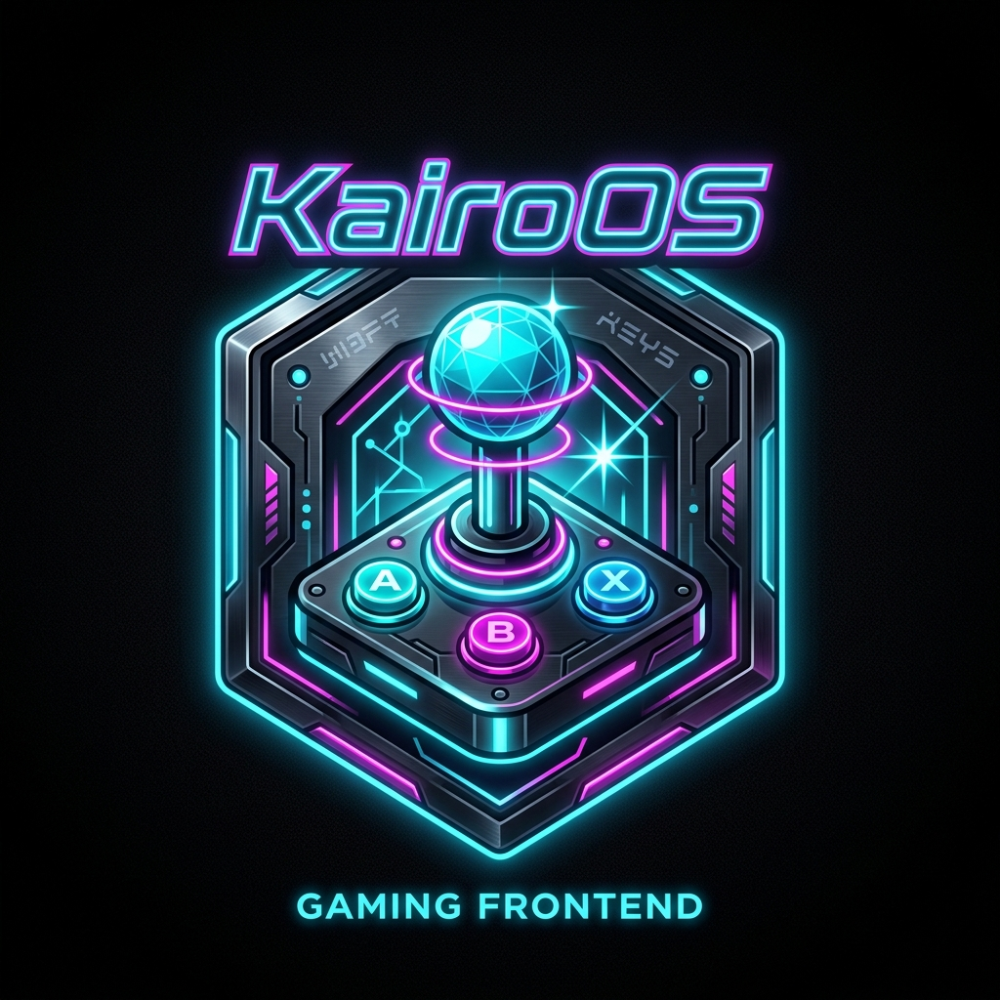

<p align="center">
  
</p>

# 🕹️ KaïroOS

**Frontend d'arcade custom complet sous Windows, 100% Open Source.**  
*Conçu pour bornes d'arcade physiques — Navigable à 100% au Joystick/Gamepad — Zéro souris, zéro clavier visible.*

[](https://www.rust-lang.org/)
[](https://v2.tauri.app/)
[](https://react.dev/)
[](LICENSE)

---

## 📖 Le Concept

**KaïroOS** transforme n'importe quel PC Windows en une borne d'arcade physique haut de gamme. L'expérience est pensée pour être **100% autonome et navigable au stick/gamepad** :
- **Unification totale** : Lancez vos jeux rétro (NES, SNES, N64, GameCube, Wii, Switch, PS1, PS2, PS3, Arcade) et vos **jeux PC Windows natifs** au même endroit.
- **Zéro friction** : Aucun curseur de souris parasite ni boîte de dialogue Windows. Tout disparaît derrière l'interface arcade.
- **Supervision intelligente** : Chronométrage précis du temps joué, suivi du PID en arrière-plan et reprise instantanée du frontend lors de la fermeture d'un jeu.
- **Contrôle à distance** : Intégration naturelle avec Sunshine/Moonlight pour le streaming vidéo complet, complété par `kairo-remote` pour l'administration et l'installation de ROMs depuis un smartphone sur le réseau local.

---

## 🏛️ Architecture du Projet

```
Kaïro/
├── crates/
│   └── kairo-core/          # Crate Rust autonome (Scanner de ROMs, SQLite, Lanceur CLI)
│       ├── src/
│       │   ├── db/          # Couche SQLite, migrations, index et requêtes optimisées
│       │   ├── models/      # Modèles de données (Game, System, Emulator, GameConfig)
│       │   ├── scanner/     # Scanner récursif de ROMs avec détection de console & SHA1
│       │   └── launcher/    # Constructeur de commandes CLI & superviseur de process
│       └── Cargo.toml
├── src-tauri/               # Application hôte Tauri 2
│   ├── capabilities/        # Permissions fenêtrage et plugins
│   ├── src/                 # Commandes IPC Tauri exposant kairo-core au frontend
│   └── tauri.conf.json      # Configuration plein écran & fenêtrage
├── src/                     # Frontend React 19 (kairo-ui)
│   ├── components/          # Composants UI arcade (Header, SystemSelector, GameGrid, Modals)
│   ├── hooks/               # useGamepad (gamepad API avec repeat rate et debounce)
│   └── types/               # Typages TypeScript synchronisés avec Rust
├── package.json             # React 19, Vite, TailwindCSS, Lucide
└── Cargo.toml               # Workspace racine Rust
```

---

## 🎮 Matrice des Émulateurs CLI Intégrés

KaïroOS utilise l'exécution en ligne de commande pure pour piloter les meilleurs émulateurs sans interface intermédiaire :

| Console / Plateforme | Émulateur Cible | Commande CLI |
| :--- | :--- | :--- |
| **NES, SNES, GBA, N64, PS1, Arcade** | **RetroArch** | `retroarch.exe -L "cores\{core}.dll" "{rom_path}"` |
| **Nintendo Switch** | **Ryujinx / Ryubing** | `ryujinx.exe -f -g "{rom_path}"` |
| **PlayStation 2** | **PCSX2** | `pcsx2.exe --nogui -batch "{rom_path}"` |
| **GameCube / Wii** | **Dolphin** | `dolphin.exe -b -e "{rom_path}"` |
| **PlayStation 3** | **RPCS3** | `rpcs3.exe --no-gui "{rom_path}"` |
| **Jeux Windows Natifs** | **Exécution Directe** | `"{exe_path}" {custom_args}` |

---

## 🕹️ Contrôles Arcade & Navigation

| Bouton Arcade / Manette | Action KaïroOS | Équivalent Clavier |
| :--- | :--- | :--- |
| **Stick / D-Pad** | Navigation dans la grille de jeux | `Flèches` ou `Z/Q/S/D` |
| **Bouton A (Croix)** | Lancer le jeu sélectionné / Confirmer | `Entrée` |
| **Bouton B (Rond)** | Fermer le modal / Retour | `Échap` ou `Retour Arrière` |
| **Bouton X (Carré)** | Ajouter / Retirer des Favoris | `F` |
| **Bouton Y (Triangle)** | Ouvrir la fiche détails & config CLI | `Espace` ou `Y` |
| **LB / RB (L1 / R1)** | Changer de console (SNES, PS2, Switch...) | `A` / `E` ou `PageUp` / `PageDown` |
| **Bouton Start** | Ouvrir le Scanner de ROMs | `M` ou `F1` |

---

## 🚀 Démarrage Rapide (Développement)

### Prérequis
- [Node.js](https://nodejs.org/) (v18+)
- [Rust & Cargo](https://rustup.rs/) (v1.80+)

### Installation & Lancement

1. **Installer les dépendances Frontend :**
   ```bash
   npm install
   ```

2. **Lancer les tests du Core Rust :**
   ```bash
   cargo test --package kairo-core
   ```

3. **Lancer KaïroOS en mode développement (Tauri 2 + Vite HMR) :**
   ```bash
   npm run tauri dev
   ```

---

## 📄 Licence

Ce projet est distribué sous licence **MIT**. Voir le fichier [LICENSE](LICENSE) pour plus de détails.

Créé avec passion par **Flow (Florian) — [FlowCreativeStudio](https://github.com/NayrolfRdgs)** & la communauté KaïroOS.
